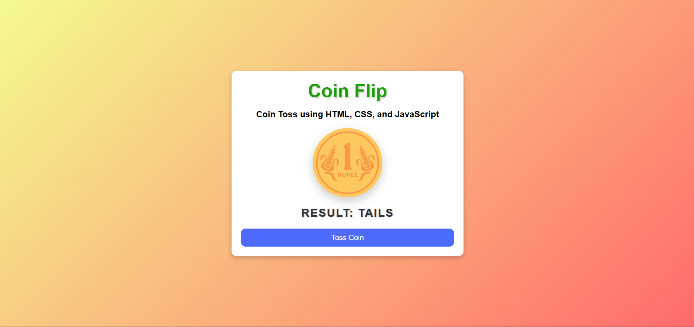

# Coin Flip Mini Project

This is a simple Coin Flip web application built using HTML, CSS, and JavaScript. The application simulates a coin toss and displays the result as either "Heads" or "Tails" with an animated coin flip effect.

## Features

- Interactive coin flip animation.
- Displays the result of the coin toss.
- Responsive design for various screen sizes.

## How to Use

1. Open the `index.html` file in your browser.
2. Click the "Toss Coin" button to flip the coin.
3. View the result displayed below the coin.

## Screenshot

